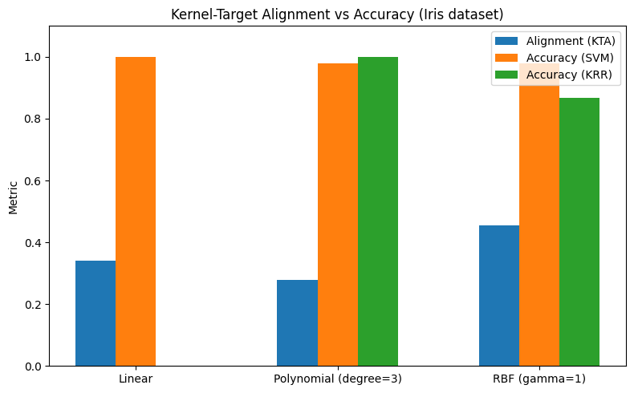
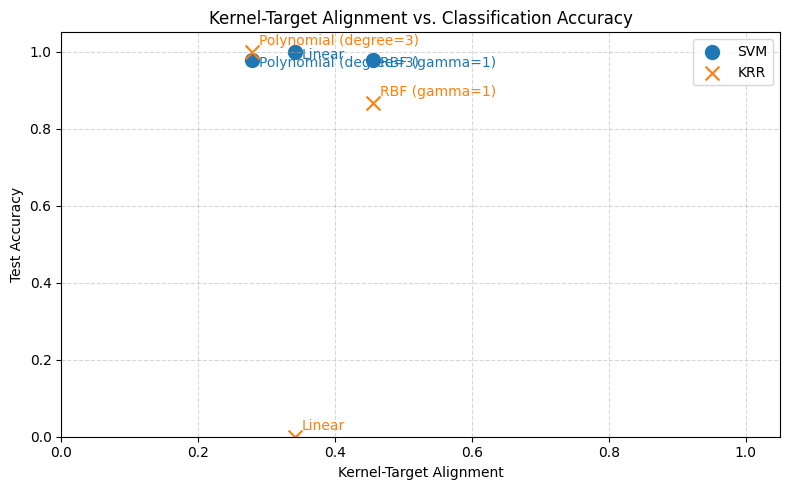

# Iris Dataset: Kernel-Target Alignment vs. SVM & KRR Accuracy

**Dataset:** Iris (multiclass, 4 features)

**Goals:**
- Compute Kernel-Target Alignment (KTA) for various kernels (Linear, Polynomial, RBF).
- Demonstrate the correlation between KTA and classification accuracy (SVM & Kernel Ridge).


```python

import matplotlib.pyplot as plt
import numpy as np
from sklearn import datasets, model_selection, svm
from sklearn.kernel_ridge import KernelRidge
from sklearn.preprocessing import StandardScaler

try:
    from kta import kta
    from kta.kernels import linear, polynomial, rbf
except ModuleNotFoundError:
    import subprocess
    import sys

    subprocess.check_call(
        [
            sys.executable,
            "-m",
            "pip",
            "install",
            "--quiet",
            "git+https://github.com/whitham-powell/kernel-target-alignment.git",
        ],
    )
    from kta import kta
    from kta.kernels import linear, polynomial, rbf
```

## 1️⃣ Load & preprocess Iris data


```python
X, y = datasets.load_iris(return_X_y=True)
X_tr, X_te, y_tr, y_te = model_selection.train_test_split(
    X,
    y,
    test_size=0.3,
    random_state=0,
    stratify=y,
)

scaler = StandardScaler().fit(X_tr)
X_tr = scaler.transform(X_tr)
X_te = scaler.transform(X_te)
```

## 2️⃣ Kernels & alignment computation


```python
kernels = {
    "Linear": lambda X, Xp=None: linear(X, Xp),
    "Polynomial (degree=3)": lambda X, Xp=None: polynomial(X, Xp, degree=3, c=1),
    "RBF (gamma=1)": lambda X, Xp=None: rbf(X, Xp, gamma=1),
}

alignments = {}
accuracies_svm = {}
accuracies_krr = {}

for name, kernel_fn in kernels.items():
    # Train Gram
    K_tr = kernel_fn(X_tr)
    # Y_kernel = Y_tr_onehot @ Y_tr_onehot.T
    alignments[name] = kta(K_tr, y_tr)

    # Test Gram
    K_te = kernel_fn(X_te, X_tr)

    # SVM
    clf_svm = svm.SVC(kernel="precomputed", C=1.0)
    clf_svm.fit(K_tr, y_tr)
    accuracies_svm[name] = clf_svm.score(K_te, y_te)

    # Kernel Ridge Regression
    clf_krr = KernelRidge(kernel="precomputed")
    clf_krr.fit(K_tr, y_tr)
    preds_krr = np.round(clf_krr.predict(K_te)).astype(int)
    accuracies_krr[name] = np.mean(preds_krr == y_te)
```

## 3️⃣ Visualize alignment vs accuracy


```python
x_labels = list(kernels.keys())
x_pos = np.arange(len(x_labels))

fig, ax = plt.subplots(figsize=(8, 5))

ax.bar(
    x_pos - 0.2,
    [alignments[k] for k in x_labels],
    width=0.2,
    label="Alignment (KTA)",
)
ax.bar(x_pos, [accuracies_svm[k] for k in x_labels], width=0.2, label="Accuracy (SVM)")
ax.bar(
    x_pos + 0.2,
    [accuracies_krr[k] for k in x_labels],
    width=0.2,
    label="Accuracy (KRR)",
)

ax.set_xticks(x_pos)
ax.set_xticklabels(x_labels)
ax.set_ylim(0, 1.1)
ax.set_ylabel("Metric")
ax.set_title("Kernel-Target Alignment vs Accuracy (Iris dataset)")
ax.legend()

plt.tight_layout()
plt.show()
```





```python
# Extract alignment and accuracy clearly
kernel_names = list(kernels.keys())
kta_values = np.array([alignments[k] for k in kernel_names])
svm_acc_values = np.array([accuracies_svm[k] for k in kernel_names])
krr_acc_values = np.array([accuracies_krr[k] for k in kernel_names])

fig, ax = plt.subplots(figsize=(8, 5))

# Plot SVM Accuracy vs Alignment
ax.scatter(kta_values, svm_acc_values, marker="o", s=100, label="SVM", color="tab:blue")

# Plot KRR Accuracy vs Alignment
ax.scatter(
    kta_values,
    krr_acc_values,
    marker="x",
    s=100,
    label="KRR",
    color="tab:orange",
)

# Annotate points
for i, txt in enumerate(kernel_names):
    ax.annotate(
        txt,
        (kta_values[i], svm_acc_values[i]),
        xytext=(5, -5),
        textcoords="offset points",
        fontsize=10,
        color="tab:blue",
    )
    ax.annotate(
        txt,
        (kta_values[i], krr_acc_values[i]),
        xytext=(5, 5),
        textcoords="offset points",
        fontsize=10,
        color="tab:orange",
    )

ax.set_xlabel("Kernel-Target Alignment")
ax.set_ylabel("Test Accuracy")
ax.set_title("Kernel-Target Alignment vs. Classification Accuracy")
ax.set_xlim([0, 1.05])
ax.set_ylim([0, 1.05])
ax.grid(True, linestyle="--", alpha=0.5)
ax.legend()

plt.tight_layout()
plt.show()
```





```python

```
