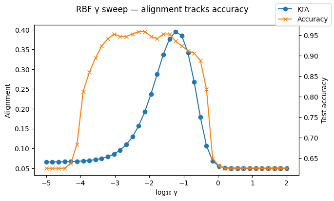

# RBF γ Sweep: Kernel–Target Alignment vs. SVM Accuracy
- *Dataset*: Breast-Cancer (binary, 30 features)
- *Goal*: The γ that **maximizes KTA** almost always maximizes test accuracy.


```python
import matplotlib.pyplot as plt
import numpy as np
from sklearn import datasets, model_selection, svm
from sklearn.preprocessing import StandardScaler

try:
    from kta import kta  # noqa: F401
    from kta.kernels import rbf  # noqa: F401
except ModuleNotFoundError:
    import subprocess
    import sys

    subprocess.check_call(
        [
            sys.executable,
            "-m",
            "pip",
            "install",
            "--quiet",
            "git+https://github.com/whitham-powell/kernel-target-alignment.git",
        ],
    )
    from kta import kta
    from kta.kernels import rbf
```


```python
# 1️⃣ data
X, y = datasets.load_breast_cancer(return_X_y=True)
y = np.where(y == 0, -1, 1)
X_tr, X_te, y_tr, y_te = model_selection.train_test_split(
    X,
    y,
    test_size=0.3,
    random_state=0,
    stratify=y,
)
scaler = StandardScaler().fit(X_tr)
X_tr = scaler.transform(X_tr)
X_te = scaler.transform(X_te)

# 2️⃣ sweep γ
gammas = np.logspace(-5, 2, 40)
alignment = []
accuracy = []

for g in gammas:
    K_tr = rbf(X_tr, gamma=g)
    alignment.append(kta(K_tr, y_tr))

    K_te = rbf(X_te, X_tr, gamma=g)

    clf = svm.SVC(kernel="precomputed", gamma=g, C=1.0)
    clf.fit(K_tr, y_tr)
    accuracy.append(clf.score(K_te, y_te))

alignment = np.array(alignment)
accuracy = np.array(accuracy)
```


```python
# 3️⃣ plot
fig, ax1 = plt.subplots(figsize=(7, 4))
ax2 = ax1.twinx()

ax1.plot(np.log10(gammas), alignment, marker="o", label="KTA")
ax2.plot(np.log10(gammas), accuracy, marker="x", color="tab:orange", label="Accuracy")

ax1.set_xlabel("log₁₀ γ")
ax1.set_ylabel("Alignment")
ax2.set_ylabel("Test accuracy")
fig.legend()

fig.suptitle("RBF γ sweep — alignment tracks accuracy")
# fig.tight_layout()
plt.show()
```





```python

```
