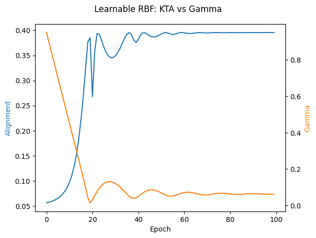

```python
# notebooks/learnable/01_optimize_single_kernel.py
```

# Optimize Single Learnable Kernel (RBF)
- Dataset: Breast Cancer
- Model: LearnableRBF
- Goal: Maximize KTA over time


```python

import matplotlib.pyplot as plt
import torch
from sklearn import datasets, model_selection, preprocessing
from sklearn.svm import SVC

try:
    from kta import LearnableRBF, kta_torch
except ModuleNotFoundError:
    import subprocess
    import sys

    subprocess.check_call(
        [
            sys.executable,
            "-m",
            "pip",
            "install",
            "--quiet",
            "git+https://github.com/whitham-powell/kernel-target-alignment.git",
        ],
    )
    from kta import LearnableRBF, kta_torch
```

## 1. Load and preprocess data


```python
X, y = datasets.load_breast_cancer(return_X_y=True)
y = (y * 2 - 1).astype(float)  # convert to {-1, 1}

X_tr, X_te, y_tr, y_te = model_selection.train_test_split(
    X,
    y,
    test_size=0.3,
    random_state=0,
    stratify=y,
)

scaler = preprocessing.StandardScaler().fit(X_tr)
X_tr = scaler.transform(X_tr)
X_te = scaler.transform(X_te)

X = torch.tensor(X_tr, dtype=torch.float32)
y = torch.tensor(y_tr, dtype=torch.float32)
```

## 2. Initialize model and optimizer


```python
model = LearnableRBF(gamma_init=1.0)
optimizer = torch.optim.Adam(model.parameters(), lr=0.05)
```

## 3. Train loop: maximize KTA


```python
alignments = []
gammas = []
accuracies = []
accuracy_freq = 1  # Check accuracy every `accuracy_freq` epochs

for epoch in range(100):
    K = model(X)
    loss = -kta_torch(K, y)
    optimizer.zero_grad()
    loss.backward()
    optimizer.step()

    alignments.append(-loss.item())
    gammas.append(model.gamma.item())

    if epoch % accuracy_freq == 0:
        with torch.no_grad():
            K_train_np = K.detach().cpu().numpy()
            X_test_tensor = torch.tensor(X_te, dtype=torch.float32)
            K_test_np = model(X_test_tensor, X).detach().cpu().numpy()
        clf = SVC(kernel="precomputed")
        clf.fit(K_train_np, y.cpu().numpy())
        acc = clf.score(K_test_np, y_te)
        accuracies.append((epoch, acc))
```

## 4. Plot results


```python
fig, ax1 = plt.subplots()
ax2 = ax1.twinx()
ax1.plot(alignments, label="KTA", color="tab:blue")
ax2.plot(gammas, label="gamma", color="tab:orange")

ax1.set_xlabel("Epoch")
ax1.set_ylabel("Alignment", color="tab:blue")
ax2.set_ylabel("Gamma", color="tab:orange")
fig.suptitle("Learnable RBF: KTA vs Gamma")
fig.tight_layout()
plt.show()
```





## 5. Accuracy Over Time


```python
if accuracies:
    epochs, accs = zip(*accuracies)
    plt.plot(epochs, accs, marker="o")
    plt.xlabel("Epoch")
    plt.ylabel("Test Accuracy")
    plt.title(f"SVC Accuracy (Every {accuracy_freq} Epochs)")
    plt.grid(True)
    plt.show()
```


## 6. Final gamma and alignment


```python
print(f"Final gamma: {model.gamma.item():.4f}")
print(f"Final alignment: {alignments[-1]:.4f}")
```

    Final gamma: 0.0621
    Final alignment: 0.3955


```python

```
