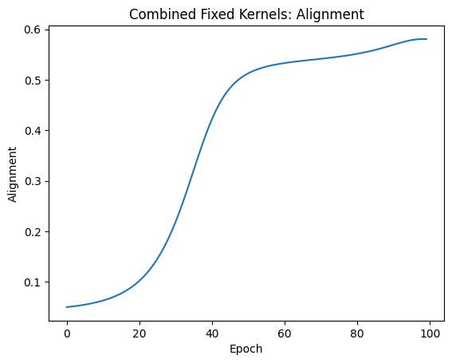
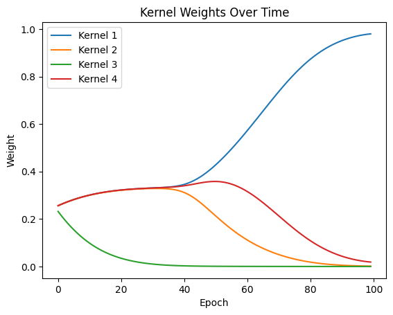
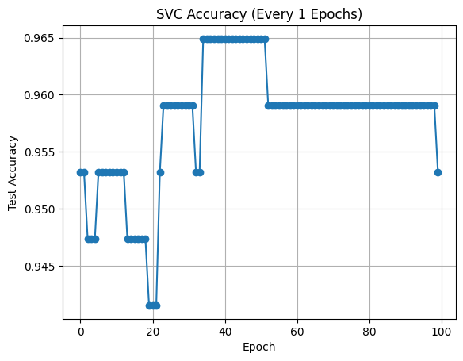

```python
# notebooks/learnable/02_combine_fixed_kernels.py
```

# Learn Weights for Fixed Kernels
- Dataset: Breast Cancer
- Kernels: Fixed RBF, Linear, Polynomial
- Goal: Learn convex weights to maximize KTA


```python
try:
    from kta import (
        FixedKernel,
        KernelCombiner,
        kta_torch,
        linear_torch,
        polynomial_torch,
        rbf_torch,
    )
except ModuleNotFoundError:
    import subprocess
    import sys

    subprocess.check_call(
        [
            sys.executable,
            "-m",
            "pip",
            "install",
            "--quiet",
            "git+https://github.com/whitham-powell/kernel-target-alignment.git",
        ],
    )
    from kta import (
        FixedKernel,
        KernelCombiner,
        kta_torch,
        rbf_torch,
        linear_torch,
        polynomial_torch,
    )

import matplotlib.pyplot as plt
import torch
from sklearn import datasets, model_selection, preprocessing
from sklearn.svm import SVC
```

## 1. Load and preprocess data


```python
X, y = datasets.load_breast_cancer(return_X_y=True)
y = (y * 2 - 1).astype(float)  # convert to {-1, 1}

X_tr, X_te, y_tr, y_te = model_selection.train_test_split(
    X,
    y,
    test_size=0.3,
    random_state=0,
    stratify=y,
)

scaler = preprocessing.StandardScaler().fit(X_tr)
X_tr = scaler.transform(X_tr)
X_te = scaler.transform(X_te)

X = torch.tensor(X_tr, dtype=torch.float32)
y = torch.tensor(y_tr, dtype=torch.float32)
X_test = torch.tensor(X_te, dtype=torch.float32)
y_test = y_te  # keep as NumPy array for SVC
```

## 2. Build fixed kernel combiner


```python
kernels = [
    FixedKernel(lambda X1, X2=None: rbf_torch(X1, X2, gamma=0.1)),
    FixedKernel(lambda X1, X2=None: rbf_torch(X1, X2, gamma=1.0)),
    FixedKernel(lambda X1, X2=None: polynomial_torch(X1, X2, degree=2, c=1.0)),
    FixedKernel(lambda X1, X2=None: linear_torch(X1, X2)),
]


model = KernelCombiner(kernels)
optimizer = torch.optim.Adam(model.parameters(), lr=0.05)
```

## 3. Optimize weights to maximize alignment


```python
alignments = []
weights_history = []
accuracies = []
accuracy_freq = 1  # Check accuracy every `accuracy_freq` epochs

for epoch in range(100):
    K_train = model(X)
    loss = -kta_torch(K_train, y)
    optimizer.zero_grad()
    loss.backward()
    optimizer.step()

    alignments.append(-loss.item())
    with torch.no_grad():
        weights_history.append(torch.softmax(model.raw_weights, dim=0).cpu().tolist())

    # Accuracy every 5 epochs
    if epoch % accuracy_freq == 0:
        with torch.no_grad():
            K_train_np = K_train.detach().cpu().numpy()
            K_test_np = model(X_test, X).detach().cpu().numpy()

        clf = SVC(kernel="precomputed")
        clf.fit(K_train_np, y.cpu().numpy())
        acc = clf.score(K_test_np, y_test)
        accuracies.append((epoch, acc))
```

## 4. Plot alignment and weight evolution


```python
fig, ax1 = plt.subplots()
ax1.plot(alignments, label="KTA")
ax1.set_ylabel("Alignment")
ax1.set_xlabel("Epoch")
ax1.set_title("Combined Fixed Kernels: Alignment")
plt.show()
```





```python
weights_history = torch.tensor(weights_history)
fig, ax = plt.subplots()
for i in range(weights_history.shape[1]):
    ax.plot(weights_history[:, i], label=f"Kernel {i+1}")
ax.set_xlabel("Epoch")
ax.set_ylabel("Weight")
ax.set_title("Kernel Weights Over Time")
ax.legend()
plt.show()
```





## 5. Accuracy vs Epoch


```python
if accuracies:
    epochs, accs = zip(*accuracies)
    plt.plot(epochs, accs, marker="o")
    plt.xlabel("Epoch")
    plt.ylabel("Test Accuracy")
    plt.title(f"SVC Accuracy (Every {accuracy_freq} Epochs)")
    plt.grid(True)
    plt.show()
```





## 6. Final Weights and Alignment


```python
print("Final weights:", torch.softmax(model.raw_weights, dim=0))
print(f"Final alignment: {alignments[-1]:.4f}")
```

    Final weights: tensor([9.7970e-01, 1.5780e-03, 1.1827e-05, 1.8707e-02],
           grad_fn=<SoftmaxBackward0>)
    Final alignment: 0.5803
