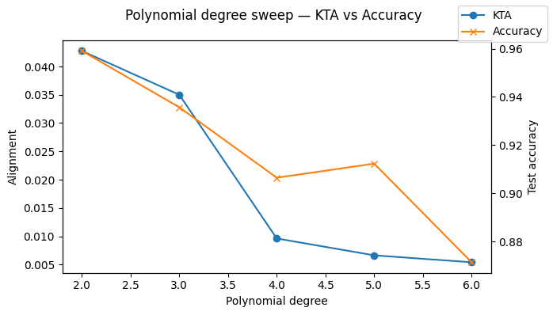
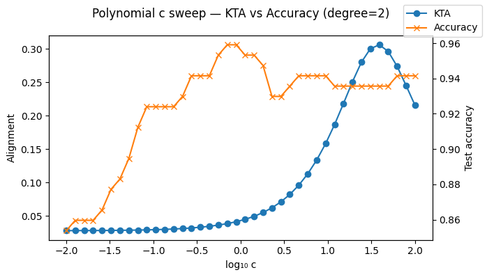
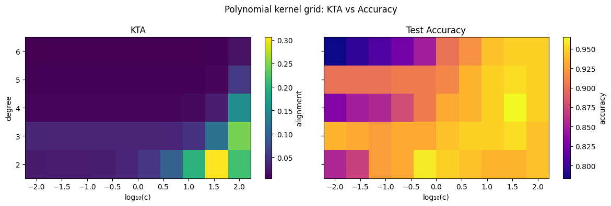
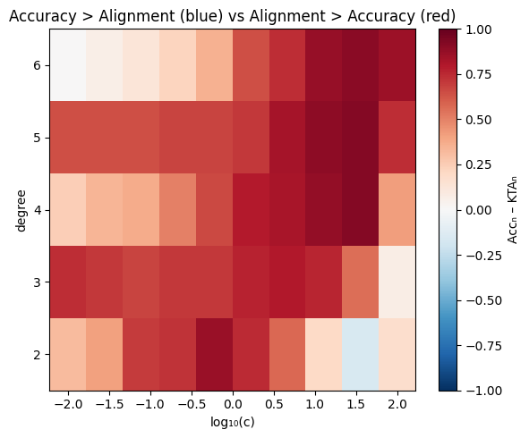
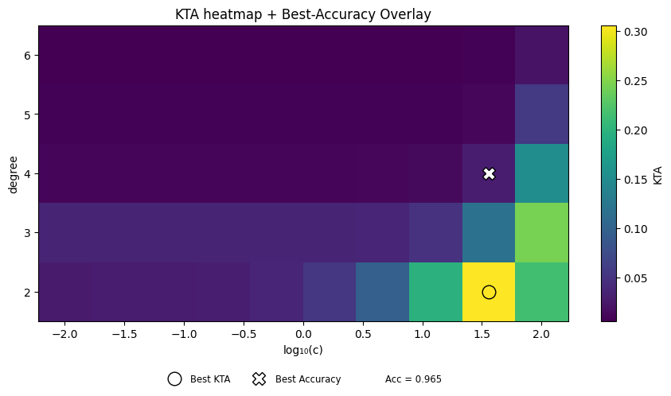

# Polynomial Degree Sweep: Kernel–Target Alignment vs. SVM Accuracy
**Dataset:** Breast Cancer (binary, 30 features)
**Goal:** Show how Kernel-Target Alignment (KTA) correlates with SVM test accuracy
as we vary the **polynomial degree** and the **offset coefficient** $c$.


```python
import matplotlib.lines as mlines
import matplotlib.pyplot as plt
import numpy as np
from sklearn import datasets, model_selection, svm
from sklearn.preprocessing import StandardScaler

# Try to import your package; install on first‐run if needed
try:
    from kta import kta  # noqa: F401
    from kta.kernels import polynomial  # noqa: F401
except ModuleNotFoundError:
    print("Installing kta package...")
    import subprocess
    import sys

    subprocess.check_call(
        [
            sys.executable,
            "-m",
            "pip",
            "install",
            "--quiet",
            "git+https://github.com/whitham-powell/kernel-target-alignment.git",
        ],
    )
    from kta import kta
    from kta.kernels import polynomial
```

## 1️⃣ Data loading & preprocessing
- Load the breast-cancer dataset
- Map labels to ±1
- Split into train/test (70/30 stratified)
- Standardize features **using only the training set**


```python
# Load & split
X, y = datasets.load_breast_cancer(return_X_y=True)
y = np.where(y == 0, -1, 1)
X_tr, X_te, y_tr, y_te = model_selection.train_test_split(
    X,
    y,
    test_size=0.3,
    random_state=0,
    stratify=y,
)

# Scale *only* on train, then apply to test
scaler = StandardScaler().fit(X_tr)
X_tr = scaler.transform(X_tr)
X_te = scaler.transform(X_te)
```

## 2️⃣ Sweep: Polynomial **degree** (fixed $c=1$)
- For each $d\in\{2,3,4,5,6\}$:
  1. Compute train–train Gram via your `polynomial(X_tr, degree=d, c=1)`
  2. Compute KTA on that Gram
  3. Compute test–train Gram via `polynomial(X_te, X_tr, degree=d, c=1)`
  4. Train a **precomputed-kernel SVM** and record test accuracy


```python
degrees = [2, 3, 4, 5, 6]
c = 1.0

alignments, accuracies = [], []
for d in degrees:
    K_tr = polynomial(X_tr, None, degree=d, c=c)
    alignments.append(kta(K_tr, y_tr))

    K_te = polynomial(X_te, X_tr, degree=d, c=c)

    clf = svm.SVC(kernel="precomputed", C=1.0)
    clf.fit(K_tr, y_tr)
    accuracies.append(clf.score(K_te, y_te))
```

### Plot Degree vs Alignment & Accuracy


```python
fig, ax1 = plt.subplots(figsize=(7, 4))
ax2 = ax1.twinx()

ax1.plot(degrees, alignments, marker="o", label="KTA")
ax2.plot(degrees, accuracies, marker="x", color="tab:orange", label="Accuracy")

ax1.set_xlabel("Polynomial degree")
ax1.set_ylabel("Alignment")
ax2.set_ylabel("Test accuracy")
fig.legend()
fig.suptitle("Polynomial degree sweep — KTA vs Accuracy")
fig.tight_layout()
plt.show()
```





## 3️⃣ Sweep: Offset coefficient **$c$** (fixed $d=2$)
- For $c\in[10^{-2},10^2]$ (40 log-spaced points), repeat the same steps as above.
 sweep coefficient c


```python
cs = np.logspace(-2, 2, 40)
degree = 2
alignments, accuracies = [], []
for c in cs:
    K_tr = polynomial(X_tr, None, degree=degree, c=c)
    alignments.append(kta(K_tr, y_tr))

    K_te = polynomial(X_te, X_tr, degree=degree, c=c)

    clf = svm.SVC(kernel="precomputed", C=1.0)
    clf.fit(K_tr, y_tr)
    accuracies.append(clf.score(K_te, y_te))
```

### a Plot: $\log_{10}(c)$ vs KTA & Accuracy


```python
fig, ax1 = plt.subplots(figsize=(7, 4))
ax2 = ax1.twinx()
ax1.plot(np.log10(cs), alignments, marker="o", label="KTA")
ax2.plot(np.log10(cs), accuracies, marker="x", color="tab:orange", label="Accuracy")
ax1.set_xlabel("log₁₀ c")
ax1.set_ylabel("Alignment")
ax2.set_ylabel("Test accuracy")
fig.legend()
fig.suptitle(f"Polynomial c sweep — KTA vs Accuracy (degree={degree})")
fig.tight_layout()
plt.show()
```





## 4️⃣ Sweep: 2-D Grid: (degree, $c$) → KTA & Accuracy heatmaps
- Build two matrices of shape ( len(degrees) × len(cs) )
- Left: **KTA** landscape, Right: **Test accuracy** landscape


```python
degrees = [2, 3, 4, 5, 6]
cs = np.logspace(-2, 2, 10)  # c from 0.01 to 100

kta_grid = np.zeros((len(degrees), len(cs)))
acc_grid = np.zeros_like(kta_grid)

for i, d in enumerate(degrees):
    for j, c in enumerate(cs):
        # train–train and test–train Gram via your polynomial()
        K_tr = polynomial(X_tr, degree=d, c=c)
        K_te = polynomial(X_te, X_tr, degree=d, c=c)

        # ① alignment
        kta_grid[i, j] = kta(K_tr, y_tr)

        # ② precomputed SVM accuracy
        clf = svm.SVC(kernel="precomputed", C=1.0)
        clf.fit(K_tr, y_tr)
        acc_grid[i, j] = clf.score(K_te, y_te)
```

### Plot side-by-side heatmaps


```python
cs_log = np.log10(cs)
deg_arr = np.array(degrees)
C, D = np.meshgrid(cs_log, deg_arr)

fig, (ax1, ax2) = plt.subplots(1, 2, figsize=(12, 4), sharex=True, sharey=True)

pcm1 = ax1.pcolormesh(C, D, kta_grid, shading="auto", cmap="viridis")
ax1.set_xlabel("log₁₀(c)")
ax1.set_ylabel("degree")
ax1.set_title("KTA")
fig.colorbar(pcm1, ax=ax1, label="alignment")

pcm2 = ax2.pcolormesh(C, D, acc_grid, shading="auto", cmap="plasma")
ax2.set_xlabel("log₁₀(c)")
ax2.set_title("Test Accuracy")
fig.colorbar(pcm2, ax=ax2, label="accuracy")
fig.suptitle("Polynomial kernel grid: KTA vs Accuracy")


plt.tight_layout()
plt.show()
```





##  Difference map: where Accuracy – KTA (normalized)
Blue → accuracy leads; Red → alignment leads.


```python
kta_n = (kta_grid - kta_grid.min()) / (kta_grid.max() - kta_grid.min())
acc_n = (acc_grid - acc_grid.min()) / (acc_grid.max() - acc_grid.min())
diff = acc_n - kta_n

fig, ax = plt.subplots(figsize=(6, 5))
pcm = ax.pcolormesh(C, D, diff, cmap="RdBu_r", shading="auto", vmin=-1, vmax=1)
fig.colorbar(pcm, ax=ax, label="Accₙ – KTAₙ")
ax.set_xlabel("log₁₀(c)")
ax.set_ylabel("degree")
ax.set_title("Accuracy > Alignment (blue) vs Alignment > Accuracy (red)")
plt.tight_layout()
plt.show()
```





### Overlay: best‐Accuracy contour on KTA heatmap
● = best KTA point; × = best accuracy point.
The white contour traces the single highest‐accuracy level.


```python

# locate best indices
i_k, j_k = np.unravel_index(np.argmax(kta_grid), kta_grid.shape)
i_a, j_a = np.unravel_index(np.argmax(acc_grid), kta_grid.shape)
best_acc = acc_grid[i_a, j_a]

fig, ax = plt.subplots(figsize=(12, 5))
pcm = ax.pcolormesh(C, D, kta_grid, cmap="viridis", shading="auto")
fig.colorbar(pcm, ax=ax, label="KTA")

# white contour @ best accuracy
ax.contour(C, D, acc_grid, levels=[best_acc], colors="white", linewidths=2)

# marker proxies
h_k = ax.plot(cs_log[j_k], degrees[i_k], "o", ms=12, mfc="none", mec="k")[0]
h_a = ax.plot(cs_log[j_a], degrees[i_a], "X", ms=12, mfc="w", mec="k")[0]
cont_proxy = mlines.Line2D([], [], color="white", lw=2)

ax.set_xlabel("log₁₀(c)")
ax.set_ylabel("degree")
ax.set_title("KTA heatmap + Best‐Accuracy Overlay")

# horizontal legend below
ax.legend(
    [h_k, h_a, cont_proxy],
    ["Best KTA", "Best Accuracy", f"Acc = {best_acc:.3f}"],
    loc="upper center",
    bbox_to_anchor=(0.5, -0.15),
    ncol=3,
    frameon=False,
    fontsize="small",
)

plt.subplots_adjust(bottom=0.25)
plt.tight_layout(rect=[0, 0, 0.75, 1])
plt.show()
```





```python

```
